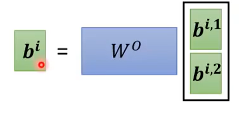

# habana gaudi 调研

## transformer 计算回顾

### self-attention

[2.11.【李宏毅机器学习】自注意力机制 (Self-attention(P2)_哔哩哔哩_bilibili](https://www.bilibili.com/video/BV1cV411X7XN?p=2&vd_source=86c5566b7e9902bcff1d7afc20ffe05b)

**Matrix!!!**

**Multi-Head-Attention**

### layer-norm

[Transformer中的归一化(五)：Layer Norm的原理和实现 & 为什么Transformer要用LayerNorm - 知乎 (zhihu.com)](https://zhuanlan.zhihu.com/p/492803886)

### position embedding

**参考之前的调研**

### Encoder

### Decoder

### mask-self-attention

### Auto-regressive

 ### cross-attention

### 非线性运算

[Transformer之Gelu激活函数 - 知乎 (zhihu.com)](https://zhuanlan.zhihu.com/p/448437889)

## Intel gaudi

[Welcome to Intel® Gaudi® v1.15 Documentation — Gaudi Documentation 1.15.1 documentation (habana.ai)](https://docs.habana.ai/en/latest/index.html)

### 关注点（学习&对标）

1. 架构
2. 性能（&比较）
   1. 访存(&互联)
   2. 计算
3. 精度
4. 训练&推理
5. 软件支持
6. 重要技术细节

### 架构

**片内架构**

**第一代**

**第二代**

**第三代**

[Intel® Gaudi® 3 AI Accelerator White Paper](https://www.intel.cn/content/www/cn/zh/content-details/817486/intel-gaudi-3-ai-accelerator-white-paper.html)

1. (GE)MME: 支持计算类型：全连接层，卷积，批-通用矩阵乘
2. TPC(Tensor Processor Core)
   1. VLIW SIMD 指令集
   2. 可编程：TPC-C提供底层软件支持
   3. 面向工作负载的特性：
      1. gemm加速：可以执行向量运算
      2. 张量寻址
      3. 延迟隐藏：多个指令槽独立发送指令（具体见重要技术细节）
      4. 随机数生成
      5. 特殊函数的高效计算（比如激活函数，损失函数-training等）

3. Media Engine: 支持优化的 数据增强和图像处理 相关的算子, 有[Operators — Gaudi](https://docs.habana.ai/en/latest/Media_Pipeline/Operators.html#media-operators)
   1. Rotator Engine: 图像的 2D 旋转，3D 旋转，投影，网格：扭曲和校正图像，重新采样器：按用户定义的坐标重新采样输入数据，使用多相滤波器重新缩放
   2. Decode Engine: Video Format(HEVC, VP9, H.264), Image Format(Jpeg 420)
4. HBM就是将很多DRAM通过3D技术集成在一个封装内，满足各种计算对高带宽的需求

### 性能

**制程**

1. gen1: 16nm
2. gen2: 7nm
3. gen3: 5nm

**访存**（&互联）

1. on-die SRAM Capacity
   1. gen1: 24MB
   2. gen2: 48MB
   3. gen3: 96MB
2. on-die SRAM Bandwidth
   1. gen2: 6.4 TB/s
   2. gen3: 12.8 TB/s

3. HBM Bandwidth
   1. gen1: 1TB/s
   2. gen2: 2.46TB/s
   3. gen3: 3.7 TB/s
4. HBM Capacity
   1. gen1: 4个HBM总共32GB存储
   2. gen2: 4个HBM2E总共96GB存储
   3. gen3: 8个HBM2E总共128GB存储
5. PCIE
   1. gen1: 16个Gen4通道，支持 Gen3（每个通道1GB/s）& Gen4（每个通道2GB/s）
   2. gen2: 同上
   3. gen3: 16个Gen5通道（每个通道4GB/s）
6. RoCE(Networking) 单向传输
   1. gen1: 互联带宽1Tb/s
   2. gen2: 互联带宽2.4Tb/s
   3. gen3: 互联带宽4.8Tb/s

**计算**

1. BF16 MME
   1. gen2: 432  TFLOPS
   2. gen3: 1835 TFLOPS
2. FP8 MME
   1. gen2: 865  TFLOPS
   2. gen3: 1835  TFLOPS
3. BF16 Vector
   1. gen2: 11  TFLOPS
   2. gen3: 28.7  TFLOPS

具体gaudi3 的计算性能参数

### 精度

1. gen1: TPC 支持FP32, BF16, INT32, INT16, INT8, UINT32, UINT16 and UINT8.

2. gen2: FP32, TF32, BF16, FP16 & FP8 (both E4M3 and E5M2) 

3. gen3:
   

   整型支持UINT32, INT32,  UINT16, INT16, UINT8 and INT8

### 训练和推理

**训练芯片和推理芯片的区别**

训练芯片需要接收大量的输入数据，并根据这些数据来调整神经网络模型的权重和参数，以使其能够准确地预测目标。

推理芯片接收新的输入数据，并基于之前训练得到的参数来进行预测或分类。只需要执行前向传播，而无需反向传播和参数调整，所以大部分的推理芯片会对前向传播过程进行优化，以提高推理速度和效率。

1. 推理芯片针对前向进行了高度优化，对参数更新和反向传播的支持就弱很多
2. 推理芯片的计算资源和内存带宽会受一定限制
3. 推理芯片的精度一般比较低（如int8），而训练阶段常用fp32
4. 片内片外的存储一般训练芯片比较大

guidi是可以支持训练的，**融合pytorch的软件栈**提供训练和推理流程，由于大模型训练一般都是多卡训练，因此 gaudi 的网络接口控制器（NIC）发挥巨大作用，gaudi 的网卡经过定制，以适应DNN 图形在网络设备之间的分布，网卡为计算引擎提供远程直接内存访问（RDMA）功能，通过可靠的连接实现高带宽和低延迟

### 软件支持

Gaudi 软件栈 和 pytorch集成在一起，并为gaudi 进行了优化；

对于gaudi的**异构硬件**（MME, TPC, DMA），graph complier 通过高效并行和流水线执行 进行优化；

TPC SDK 支持更宽的矢量数据类型，如 矢量 float64, uchar256 等，支持：

- 张量内存访问
- 特殊函数加速
- 随机数生成
- 多种数据类型

TPC 编程主要有

1. 在TPC上执行的代码，基于TPC的ISA（VLIW）
2. 在主机上执行的代码，处理**众多TPC处理器之间动态分配**程序执行

### 重要技术细节

intel gaudi 和其他AI芯片主要的不同之处在于 以太网互联（主要是对于服务器）和 TPC，另外介绍下media Engine(gaudi2/3)

#### TPC

[Processor Architectural Overview](https://docs.habana.ai/en/latest/TPC/TPC_User_Guide/Processor_Architectural_Overview.html)

**指令槽和流水线**

有四种指令槽（for TPC），每个指令槽可以“独立”地执行指令

- Load slot - loads from memory, moves and set values.
- SPU slot - performs scalar arithmetic.
- VPU slot - performs vector arithmetic.
- Store slot - stores to memory, moves and set values.

**exposed pipeline architecture**: 流水线各个阶段对程序员可见，内置函数提供直接编写这些阶段的代码

每个指令都有既定的若干周期的延迟，因此不同指令槽之间的指令执行**需要考虑冲突**，

**谓词执行（Predication Execution）** 

（名词解释可以参考 [谓词执行及其关键技术浅析](https://www.jsjkx.com/CN/article/openArticlePDF.jsp?id=15287)）

​		**条件执行技术** (GuardedExecution) 能够将 控制相关 于一条分支指令的其他指令转换为数据相关于该分支条件的条件指令，它含有显式 的条件指示符，首先计算指令执行条件 ，如果条件为真 ，则执行该指令 中的操作 ，否则将其作为空操作处理

​		**谓词执行技术** 是条件执行技术的一种实现，它为每条指令增加一个源操作数 (谓词 )作为指令执行条件 ，当谓词为真时执行指令中的操作，否则将其转换为空操作处理； 

优点：增加指令级并行性，减少控制流变化，减少指令cache的失效

缺点：需要指令集支持（硬件修改），需要编译器专门支持，执行的无效指令增加

SPU 支持标量谓词执行，基于单一的条件值（一个标量寄存器的值）来决定是否执行相应的指令，适用于操作基于单个数据点的情况

VPU支持标量谓词或者向量（位数组）谓词执行，当使用位数组作为谓词时，可以实现对向量中特定元素的屏蔽操作，即可以选择性地对向量的各个元素逐一进行判断，决定是否执行相应的向量操作；这种方式在处理向量操作时非常灵活，特别是在需要对向量中的特定数据进行条件处理的场合。

**global memory** （L2/3Cache+HBM）

全局memory的写入和指令的执行不是同步的（可能存在延迟），因此需要一些 原子信号操作，确保**写后读**等冲突的避免

**Local memory**（分为scalar Local Memory 和 Vector）

每个TPC只能访问自己的Local memory, Local memory 的数据更新和指令的执行是同步的，也就是不需要额外的同步操作。

分为标量local memory(1KB, **4-byte 对齐**) 和 向量 local memory(80KB, **128-/256-byte 对齐**)， 但向量local memory对于特殊函数的操作，例如tanh, sin, cos,等 只能访问16KB

local memory 在每个周期内读取或写入，没有带宽限制

**Configuration Space**

包括张量描述符、程序二进制位置等信息，是为了成功执行程序的配置空间

#### MME

这里的Cache就是On-die SRAM，MME0，MME2，MME4和MME6都从张量A的上部拉动，而MME0和MME1共享四分之一的TensorB

**将一个大MME分为多个小MME块的优点:**

首先，a和b均有256x256个MAC，均可同时进行256x256个计算，但a中具体计算过程“可以”是

1. 先将数据B的256*256个数据加载到MME中
2. 然后数据A每个cycle输入256个数据，依次经过256列，计算256次

这样实现了矩阵乘法运算，b同理，但从带宽的角度看，a每个cycle 最多只能接受256+256个byte的数据，但b每个cycle最多可以接受 （16+16）x 256 个byte的数据，是a的16倍，**b可以实现更大的吞吐量**，与此同时可以减少不必要的数据传输，提高计算资源利用率，降低能耗

#### 互联技术

英伟达用的是NVLink ， 英特尔和AMD用的是以太网

#####  NVLink

[NVIDIA NVLink概述 | 飞速（FS）社区](https://community.fs.com/cn/article/an-overview-of-nvidia-nvlink.html)

NVLink是一种解决服务器内**GPU之间**通信限制的协议, 第四代NVLink提供更高的带宽，每条通道达到112Gbps，比PCIe Gen5通道速率快三倍。

NVSwitch芯片是一种物理芯片，类似于交换机ASIC，可通过高速的NVLink接口连接多个GPU，提高服务器内的通信和带宽。

##### **RoCEv2**

Gaudi3 加速器网络子系统拥有 24 个 200 千兆位以太网网卡端口、一个二层 MAC 和 RDMA 引擎；为适应常见的云基础设施，网卡端口使用以太网（Eth）连接，每个方向的聚合带宽为 4.8Tb/s，支持多个端口配置。NIC（网卡）实现了 RoCE v2 规范，受益于常用的以太网基础设施和 InfiniBand (IB) 协议的可靠、低延迟 RDMA。Gaudi 加速器实施扩展了 RoCE v2 规范，使其更适合 DNN 应用程序和大规模部署，可通过数千个Gaudi 加速器实现线性扩展。

[1. RDMA概述 - 知乎 (zhihu.com)](https://zhuanlan.zhihu.com/p/138874738)

在使用了RDMA技术时，两端的CPU几乎不用参与数据传输过程（只参与控制面）。本端的网卡直接从内存的用户空间DMA拷贝数据到内部存储空间，然后硬件进行各层报文的组装后，通过物理链路发送到对端网卡。对端的RDMA网卡收到数据后，剥离各层报文头和校验码，通过DMA将数据直接拷贝到用户空间内存中。

实际上是**把报文封装和解析放到硬件中做了**

[RDMA之RoCE & Soft-RoCE - 知乎 (zhihu.com)](https://zhuanlan.zhihu.com/p/361740115)

RoCE本身确实可以由软件实现，但是商用的时候，几乎不会有人用软件实现的RoCE。RDMA技术本身的一大特点就是“硬件卸载”，即把本来软件（CPU）做的事情放到硬件中实现以达到加速的目的。CPU主要是用来计算的，让它去处理协议封包和解析以及搬运数据，这是对计算资源的浪费。所以RoCE网卡会把TCP/IP协议栈放到硬件中实现以解放CPU，让它去做更重要的事。

结合gaudi 就是cpu控制网卡将数据直接放到memory里（这里应该是HBM的DRAM里），然后cpu再控制将HBM里的数据送进SRAM里

**gaudi3 SRAM**

96MB的SRAM可以被配置为L2/L3Cache, L3 Cache是一个通用的最后一级cache，就是四个部分都用的，L2 Cache是将SRAM分为4个部分，每个部分对应于2MME和16TPC，

